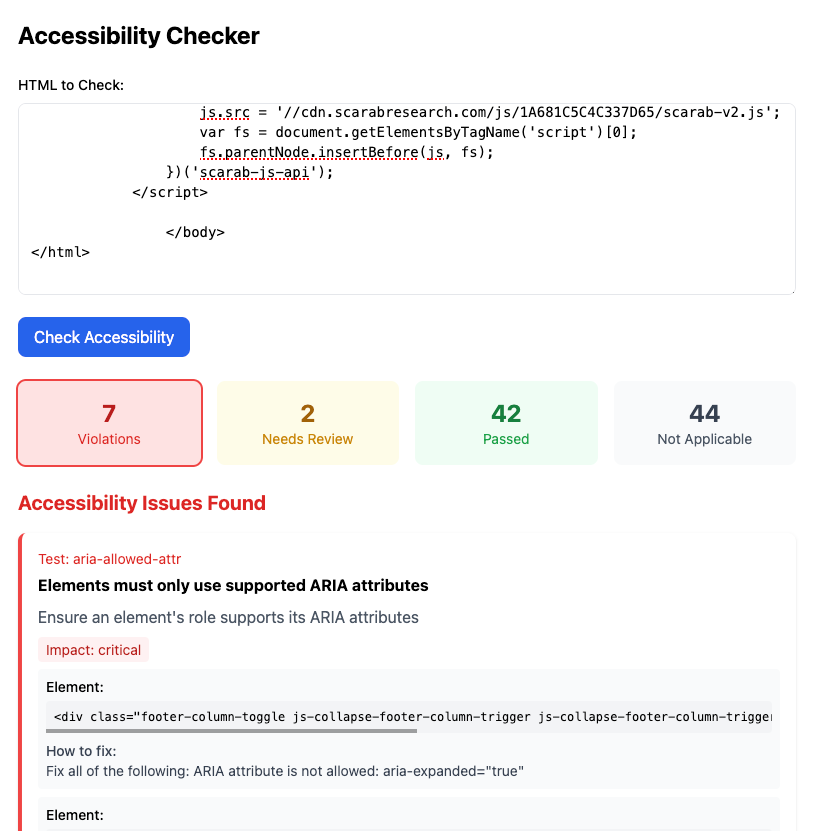

# Web Accessibility Checker

## Overview
This tool helps identify accessibility issues in web content by analyzing HTML code against WCAG (Web Content Accessibility Guidelines) standards. It provides feedback about potential barriers that might prevent people with disabilities from using your website effectively.

Check out the live demo: [Web Accessibility Checker](https://accessibilty-webchecker.vercel.app/)



## Who Is This For?
- Content creators
- Web editors
- Quality assurance testers
- Anyone who needs to check web content for accessibility compliance

## How to Use

### 1. Basic Usage
1. Copy your HTML code
2. Paste it into the textarea
3. Click "Check Accessibility"
4. Review the results

### 2. Understanding Results

The checker shows four categories:
- **Violations**: Critical issues that must be fixed
- **Needs Review**: Issues that require human judgment
- **Passed**: Elements that meet accessibility standards
- **Not Applicable**: Rules that don't apply to your content

### 3. Test Cases

#### Common Issues Example:
```html

### Select Element Accessibility Test

#### Failing Example (Shows Violation):
```html
<!DOCTYPE html>
<html>
<head>
    <title>Product Form</title>
</head>
<body>
    <main>
        <h1>Product Details</h1>
        <form>
            <div>
                <select>
                    <option value="">Select category</option>
                    <option value="1">Electronics</option>
                    <option value="2">Books</option>
                </select>
            </div>
        </form>
    </main>
</body>
</html>
```

**Why it fails:**
- The `<select>` element has no associated label
- Screen readers can't properly announce the purpose of this control
- Users have no context about what they're selecting

#### Passing Example (Fixed):
```html
<!DOCTYPE html>
<html>
<head>
    <title>Product Form</title>
</head>
<body>
    <main>
        <h1>Product Details</h1>
        <form>
            <div>
                <label for="category">Category:</label>
                <select id="category" name="category">
                    <option value="">Select category</option>
                    <option value="1">Electronics</option>
                    <option value="2">Books</option>
                </select>
            </div>
        </form>
    </main>
</body>
</html>
```

**How it's fixed:**
- Added a `<label>` element with a proper `for` attribute
- Added matching `id` attribute to the select element
- Added `name` attribute for form submission
- Screen readers can now properly announce "Category" when focusing the select element

**To test:**
1. Copy either example into the accessibility checker
2. The first example will show the "select-name" violation
3. The second example will pass the check

## Common Issues and How to Fix Them

1. **Missing Image Descriptions**
   - ❌ ``
   - ✅ ``

2. **Unclear Links**
   - ❌ `<a href="#">Click here</a>`
   - ✅ `<a href="#">View product details</a>`

3. **Missing Form Labels**
   - ❌ `<input type="text">`
   - ✅ `<label for="name">Name:</label><input type="text" id="name">`

4. **Poor Heading Structure**
   - ❌ Using `<div>` with large text
   - ✅ Using proper heading tags (`<h1>`, `<h2>`, etc.)

## Best Practices for Testing

1. **Test Common Elements**
   - Forms and inputs
   - Images and media
   - Navigation menus
   - Buttons and links
   - Tables and data presentation

2. **Check Interactive Features**
   - Form validation messages
   - Error notifications
   - Status updates
   - Modal dialogs
   - Dropdown menus

3. **Review Text Content**
   - Heading structure
   - Link text clarity
   - Error messages
   - Instructions and labels

## Example Test Scenarios

### Scenario 1: Contact Form
Test a basic contact form to ensure:
- All fields have labels
- Required fields are marked
- Error messages are clear
- Submit button is properly labeled

### Scenario 2: Product Listing
Check a product listing page for:
- Product images have alt text
- Prices are properly labeled
- Action buttons are clear
- Sort/filter controls are accessible

## Tips for Better Results

1. Use semantic HTML whenever possible
2. Provide text alternatives for images
3. Use proper heading structure
4. Label all form controls
5. Ensure sufficient color contrast
6. Make interactive elements keyboard-accessible
7. Provide clear error messages
8. Use ARIA labels when needed

## Getting Help

If you're unsure about results:
1. Read the detailed descriptions provided
2. Check the "Learn more" links for each issue
3. Consult WCAG documentation
4. Ask a developer for clarification

## Remember
- Accessibility is about real people using your content
- Automated testing catches common issues but isn't perfect
- Some aspects require manual testing
- When in doubt, simpler is usually better